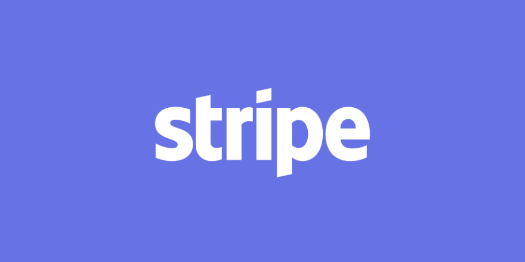

# Case Study 
## Overview and Origin 
* The name of the company that I chose is Stripe. It is an online payment proccessing company.
* The company was founded in 2009 by two brothers Patrick and John Collison.
* They first created Auctomatic, a marketplace system that heavily focused the local aspect when they noticed Craigslist andf eBay was inefficient in Ireland which they are from.
* Patrick and John realized how difficult it was obtaining their users money on Auctomatic, giving them the idea of Stripe, which makes it easier for small businesses to accept payments online. 
* The brothers sold Auctomatic to Live Current Media for $5 million, and recieved early funding by  YC (Y Combinator) an American technology startup accelorator. Stripe currently has investors including PayPal co founders Peter Thiel, Elon Musk, and Max Levchin. 

## Business Activites
* Stripe builds a platform for companies from startups to Fortune 500s move money as simple as possible.
* The brothers original goal for the company was helping small/stratup companies receive and move payments from consumers. Now they work with companies like Google and Amazon. 
* Two large competitors of Stripe are PayPal and Square. Stripe does not charge for the first $1 million in recurring transactions, afterwards they charge .4% per transaction after that, while companies like PayPal are increasing their cost for businesses. 
* Stripe uses a multitude of applications, utilities, DevOps, and buisness tools. Such as Ruby, Google Analytics, PagerDuty, and Clara Labs. 

## Landscape
* Stripe is in the Payments and Billing domain of FinTech.
* 
* Some other major companies in the Payments/Billings induistry are Venmo, Paypal, Square, Apple, and Google. 

## Results
* Buinesses that switched to the Stripe Payment Element saw a 10.5% increase in revenue.  
* 