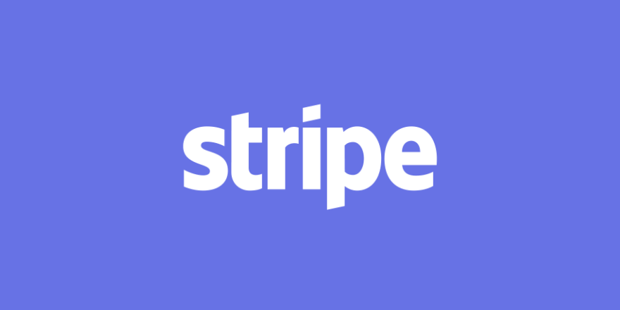

# From Ireland to Silicon Valley: The Origin of Stripe 

## Overview and Origin 
* The name of the company that I chose is Stripe, an online payment processing company.
* The company was founded in 2009 by two brothers, Patrick and John Collison.
* They first created Auctomatic, a marketplace system that heavily focused the local aspect of their home country, Ireland. When they noticed Craigslist and eBay were inefficient.
* Patrick and John realized how difficult it was obtaining their users money on Auctomatic, giving them the idea of Stripe, which makes it easier for small businesses to accept payments online. 
* The brothers sold Auctomatic to Live Current Media for $5 million, and received early funding by  YC (Y Combinator) an American technology startup accelerator. Stripe currently has investors including PayPal co founders Peter Thiel, Elon Musk, and Max Levchin. 

## Business Activities
* Stripe builds a platform for companies from startups to Fortune 500s move money as simple as possible.
* The brothers original goal for the company was helping small/startup companies receive and move payments from consumers. Now they have expanded to cover companies like Google and Amazon. 
* Two notable competitors of Stripe are PayPal and Square. Unlike their competitors, Stripe does not charge for the first $1 million in recurring transactions, afterwards they charge   .4% per transaction after that, while companies like PayPal are increasing their cost for businesses. 
* Stripe uses a multitude of applications, utilities, DevOps, and business tools. Such as Ruby, Google Analytics, PagerDuty, and Clara Labs. 
    * Ruby, an open source programming language, places emphasis on simplicity and productivity. 
        * Ruby sits along with a handful of other languages used in Stripe, which helps their engineers become more productive. 
    * Google Analytics is and Enterprise-class web analytic program. 
        * Google Analytics measures the transactions and revenue Stripe generates. 
    * PagerDuty is an incident management with powerful visibility, reliable alerting, and improved collaboration. 
        * PagerDuty helps Stripe by integrating data from multiple systems into a single view for their teams. 
    * Clara Labs is an intelligent personal assistant that manages your calendar.
        * Clara Labs helps schedule meetings for different teams, in different sectors of Stripe.

## Landscape
* Stripe operates in the Payments and Billing domain of FinTech.
* In the last 5-10 years there has been a huge increase in e-commerce activity. With this increase there is still a lot of work retailers can improve on online checkouts. Consumers are showing a large desire for increased payment options at online checkout.
* Other prominent players in the Payments/Billings industry are Venmo, Paypal, Square, Apple, and Google. 

## Results
* Businesses that switched to the Stripe Payment Element saw a 10.5% increase in revenue.  
* As of 2020, CB Insights approximates that payments processed through Stripe amassed a cumulative total of $350 billion. This marks a notable surge of 133% compared to the estimated $150 billion recorded in 2019.
* As previously mentioned, Paypal stands as their largest competitor, they control 55.58% of the online payment industry (John Hughes, Businesschronicler) and continuing to grow, while Stripe has a 20.59% market share.  
## Recommendations
* The first recommendation I would make for Stripe would be to develop a user-friendly interface for in-person retailers. While their primary focus is online retailers.  
* This would benefit the company by significantly broadening their market reach.
* Some additional technologies that would be utilized would be point-of-sale (POS) systems for retailers such as restaurants, supermarkets, and department stores. 
* This would be beneficial for Stripe because there would be a mass exposure of Stripes services if they could push into these stores whereas they are primarily used for online purchases. 

### Work Cited

https://techcrunch.com/2012/05/20/the-story-behind-payment-disruptor-stripe-com-and-its-founder-patrick-collison/

https://www.inc.com/matthew-wong/stripe-john-collison-irish-entrepreneur-tipperary-to-silicon-valley.html

https://www.cnbc.com/2017/03/20/stripes-20-something-founders-are-now-worth-more-than-1-billion-each.html

https://www.forbes.com/companies/stripe/?sh=723599194639

https://stripe.com/customers

https://stackshare.io/stripe/stripe

https://backlinko.com/stripe-users

https://businesschronicler.com/competitors/stripe-competitors-analysis/
